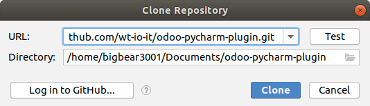

# Installing

The Plugin will be made available in the [JetBrains Plugin Repository](https://plugins.jetbrains.com/plugin/13083-odoo-support-for-pycharm)

Alternatively you can install it as a local file
* Download [odoo_plugin.jar](odoo_plugin.jar)
* In PyCharm in File > Settings > Plugin select the gear icon.
* Select install plugin from disk and choose the downloaded odoo_plugin.jar

# Contributing

## Checkout and open Odoo Autocompletion Plugin in IntelliJ IDEA

1. git clone https://github.com/wt-io-it/odoo-pycharm-plugin.git into a directory
1. Open a new project by selecting File > New > Project from Version Control > Git
1. Enter `https://github.com/wt-io-it/odoo-pycharm-plugin.git` into the Field URL
   
1. Start coding

## Agreement to publish the code in the Jetbrains Plugin Repository 

By contributing you agree that this plugin is also published in the JetBrains Plugin Repository under the terms of the
JetBrains Plugin Marketplace Developer Agreement